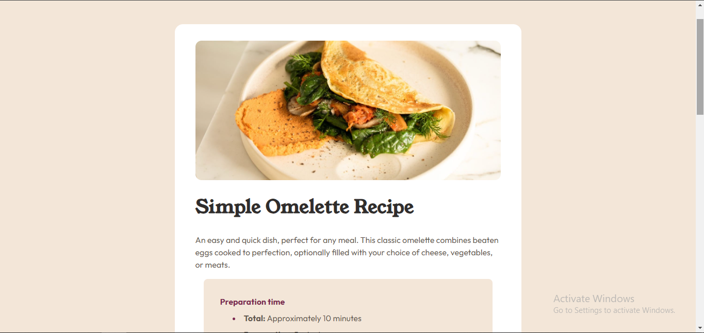

# Frontend Mentor - Recipe page solution

## Table of contents

- [Overview](#overview)
  - [The challenge](#the-challenge)
  - [Screenshot](#screenshot)
  - [Links](#links)
- [My process](#my-process)
  - [Built with](#built-with)
  - [What I learned](#what-i-learned)
  - [Continued development](#continued-development)
  - [Useful resources](#useful-resources)
- [Author](#author)

## Overview

### Screenshot

### Links

- Solution URL: [Add solution URL here](https://your-solution-url.com)
- Live Site URL: [Add live site URL here](https://your-live-site-url.com)

## My process

### Built with

- Semantic HTML5 markup
- Mobile-first workflow
- [React](https://reactjs.org/) - JS library
- [React](https://tailwindcss.com/) - Tailwind CSS
- [React](https://typescriptlang.org/) - TypeScript

### What I learned

Tailwind concepts.
Typescript concepts.
React concepts.

### Continued development

React, TypeScript, Tailwind.

### Useful resources

- [Tailwind Docs](https://www.tailwindcss.com/docs) - This is the official tailwind docs I used for referencing.

## Author

- Website - [www.georgeasiedu.tech](https://www.georgeasiedu.tech)
- Frontend Mentor - [@george5-star](https://www.frontendmentor.io/profile/george5-star)
- Twitter - [@george5_star](https://www.twitter.com/george5_star)
